# Citi Bike Forecast Benchmark: Methods and Results

## Abstract

This benchmark asks whether recent-demand and machine-learning models improve hourly station-level Citi Bike demand forecasts, and whether any forecast gain reduces simulated inventory failures. Using the official VP-RNN open dataset for 30 stations in 2018, we forecast pickup and return counts separately at two-hour and day-ahead horizons under strict chronological backtests. LightGBM with a Poisson objective achieves the lowest forecast MAE at both horizons. Yet the simpler Recent Average produces fewer simulated inventory failures under the documented daily starting-inventory decision rule. A separate observed-weather experiment improves accuracy—especially day-ahead—but is explicitly a hindsight upper bound rather than an operational weather-input result.

## 1. Research question and scope

The primary question is:

> On a manageable station-level Citi Bike dataset, how much do recent-demand and machine-learning models improve on a leakage-safe historical baseline, and do those gains reduce simulated pickup and return failures?

The benchmark intentionally stays within a transparent scope:

- station-hour pickup and return count forecasts, not network-wide routing;
- 30 reference stations, not the full New York system;
- 60-minute data, not a higher-frequency operational simulator;
- starting-inventory decisions at the station-day level, not truck routing;
- observed weather only as a clearly labeled sensitivity analysis.

## 2. Data and preprocessing

### Source

The source is the official [variational-poisson-rnn repository](https://github.com/DanieleGammelli/variational-poisson-rnn), pinned at commit `abf77f79fc64be75ae9102ec8d537f77ed9c5f8f`. The modern Python 3.11 implementation here treats that repository as a data source and method reference; it does not depend on the legacy runtime.

The source provides 30 station-level 60-minute demand files for 2018. The analysis maps:

| Canonical field | Source field / derivation |
| --- | --- |
| Pickups | `count_pickup`, cross-checked against raw `inventory_change == -1` events |
| Returns | `count_return`, cross-checked against raw `inventory_change == +1` events |
| Net flow | Returns minus pickups |
| Capacity | `station_information_citibike.capacity` |

The [source data audit](../reports/audit/data_audit.md) records schemas, input hashes, quality checks, licensing, and the exact source pin.

### Timezone and DST policy

The source uses unzoned civil-hour labels. For an actual `America/New_York` hourly grid, the pipeline removes the nonexistent spring-forward 02:00 source row after checking that it contains zero demand. It retains the ambiguous fall-back 01:00 as the first occurrence, creates a zero-count second occurrence, and marks both incomplete. The 30-station core panel contains 262,800 station-hours, of which 60 are explicitly incomplete because of this source ambiguity.

This is preferable to silently treating an ambiguous civil-hour label as a known instant. When a seasonal-naive weekly lag reaches one of those rows, the target is excluded uniformly from every model, preserving equal scored support.

## 3. Forecast tasks and chronological design

Each model predicts pickups and returns separately.

| Task | Forecast origin | Targets |
| --- | --- | --- |
| Two-hour ahead | Every hour | `t+1`, `t+2` pickup and return counts |
| Day ahead | 23:00 of the preceding local day | All 24 pickup and return counts for the next day |

The primary no-weather run uses three expanding chronological folds. Each has at least 120 training days, 28 validation days, and 28 test days.

| Fold | Test period |
| --- | --- |
| 0 | 2018-10-08–2018-11-05 |
| 1 | 2018-11-06–2018-12-03 |
| 2 | 2018-12-04–2018-12-31 |

All demand lags and rolling windows end at or before the forecast origin. Validation and test targets never influence station selection, preprocessing, imputation, feature scaling, or model selection. The [leakage audit](../reports/audit/leakage_audit.md) provides concrete timestamp examples and automated-test references.

## 4. Models

| Model | Definition |
| --- | --- |
| Seasonal naive | Same station and hour, seven days earlier |
| Historical average | Expanding mean for station × weekday × hour, using only observations available before the origin |
| Recent average | Mean over the four latest matching weekly observations |
| Global Poisson GLM | Station, calendar, horizon, lag/rolling, balance, and capacity inputs; preprocessing fit on training only |
| LightGBM Poisson | Global Poisson gradient boosting with a restrained validation-only parameter search |
| Compact Poisson GRU | Optional, separate no-weather sequence model added only after all required baseline, decision, report, and audit gates |

Historical Average is an expanding seasonal baseline—not a past-year or exact same-date lookup. To forecast a station's Tuesday 08:00 pickups, it averages prior observed Tuesday-08:00 pickups at that station and never sees the target or future values.

## 5. Forecast evaluation

The primary comparison reports MAE, RMSE, WAPE, Poisson deviance, descriptive R², signed error, peak-period error, station-level summaries, and paired day-block bootstrap comparisons against Historical Average. The following headline table aggregates the accepted core predictions.

| Model | Two-hour MAE | Day-ahead MAE | Two-hour improvement vs. Historical | Day-ahead improvement vs. Historical |
| --- | ---: | ---: | ---: | ---: |
| LightGBM Poisson | **2.9036** | **3.5136** | **1.1860** | **0.5760** |
| Recent average | 3.9816 | 3.9816 | 0.1080 | 0.1080 |
| Historical average | 4.0896 | 4.0896 | 0.0000 | 0.0000 |
| Seasonal naive | 4.3287 | 4.3287 | -0.2391 | -0.2391 |
| Poisson GLM | 4.8428 | 6.4753 | -0.7532 | -2.3857 |

### Figure 1. Aggregate MAE by forecast horizon

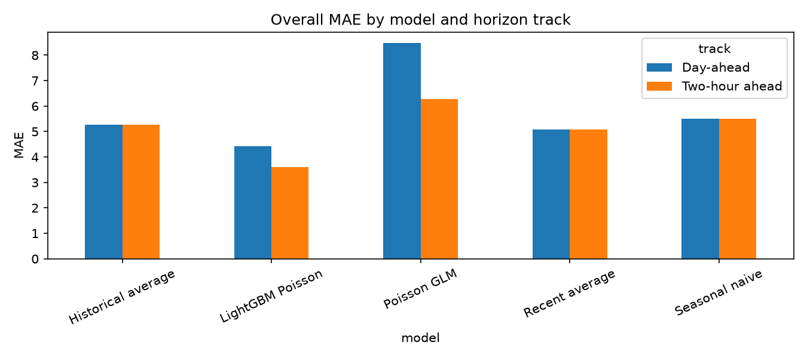

**Finding:** LightGBM is the most accurate model at both horizons. The gap is especially clear day-ahead, where a global nonlinear model can exploit calendar and demand-history structure better than the historical alternatives.

### Figure 2. Pickup and return performance

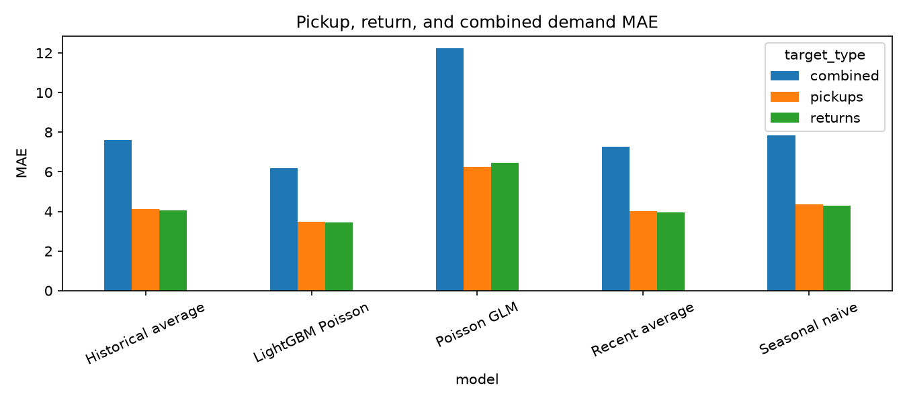

### Figure 3. Peak-period MAE

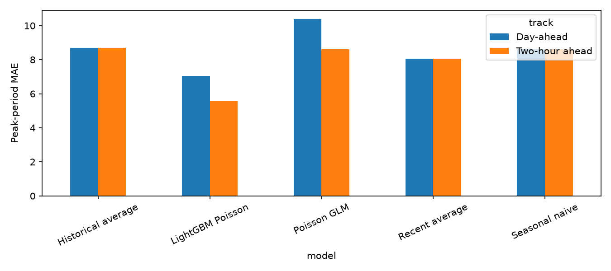

### Figure 4. Station-level combined-demand MAE

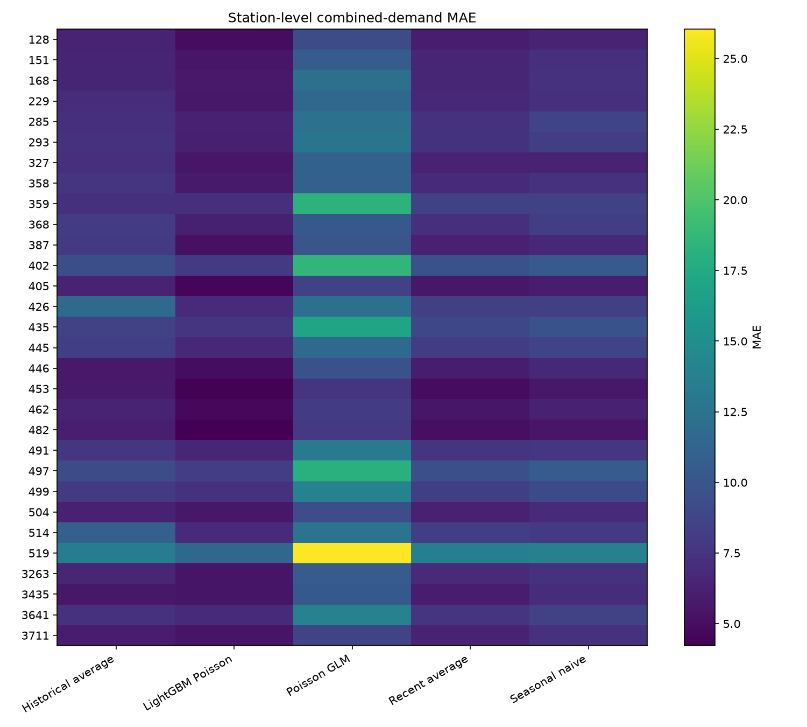

The station-level view is important: the aggregate winner is not assumed to improve every station equally.

## 6. Inventory-decision evaluation

For each station-day and model, the evaluation chooses every feasible starting inventory using the predicted day-ahead pickup/return path, selects the best forecast-implied level, and replays realized hourly demand against the known station capacity. It compares that outcome with an oracle that selects starting inventory using the realized path.

The primary convention applies pickups before returns within an aggregate hourly interval; the reverse ordering is reported as a sensitivity. Truck routing is outside this version.

| Model | Total failures | Mean service level | Mean oracle regret |
| --- | ---: | ---: | ---: |
| Recent average | **64,360** | 0.9540 | **4.2362** |
| Historical average | 64,546 | **0.9540** | 4.3069 |
| Seasonal naive | 65,092 | 0.9533 | 4.5361 |
| LightGBM Poisson | 67,902 | 0.9512 | 5.6639 |
| Poisson GLM | 73,899 | 0.9466 | 8.0644 |

### Figure 5. Forecast accuracy does not automatically minimize failures

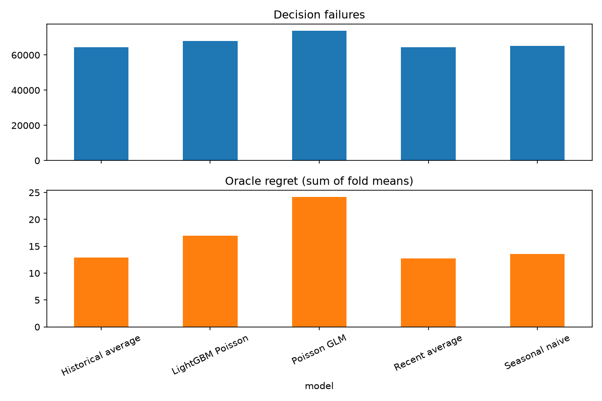

LightGBM improves forecast MAE without producing the lowest simulated failures under this decision rule. This is not evidence that LightGBM is operationally harmful; it says that a point-forecast accuracy metric and this specific nonlinear inventory objective are not identical.

### Figure 6. Training-time comparison

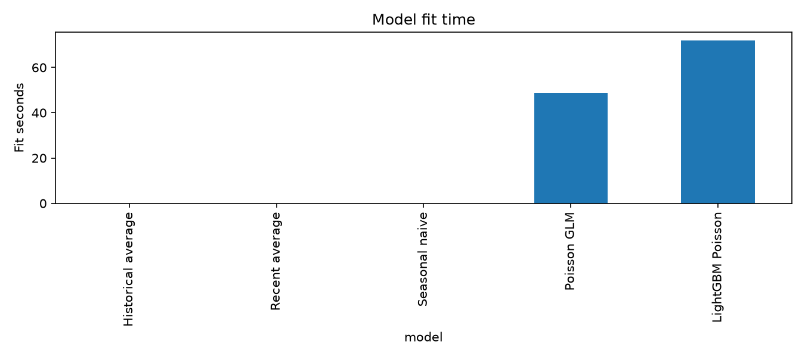

## 7. Observed-weather hindsight upper bound

The primary comparison does not include weather. The separate experiment **`observed_weather_hindsight_upper_bound`** joins realized target-time weather after the no-weather study is complete.

| Model / horizon | No-weather MAE | Observed-weather MAE | Improvement |
| --- | ---: | ---: | ---: |
| LightGBM, two-hour | 2.9036 | 2.8305 | 0.0731 |
| LightGBM, day-ahead | 3.5136 | 3.0802 | 0.4334 |
| Poisson GLM, two-hour | 4.8428 | 4.1771 | 0.6657 |
| Poisson GLM, day-ahead | 6.4753 | 4.7936 | 1.6817 |

### Figure 7. Observed weather helps more day-ahead

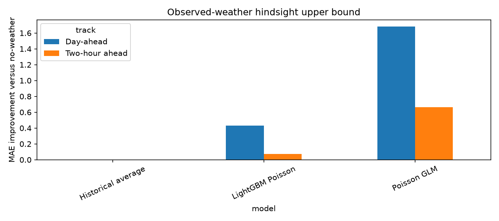

This is an **upper bound**, not an operational weather result: realized future weather was not available at forecast time. Archived forecast-vintage weather is required before making a live-deployment claim.

## 8. Optional compact Poisson GRU

The compact GRU uses 24-hour origin-ending pickup/return sequences, a completeness channel, station embeddings, calendar/horizon context, Poisson negative log-likelihood, fixed seeds, and validation early stopping. It was only added after all core acceptance gates passed.

| Model | Two-hour MAE | Day-ahead MAE | Primary inventory failures |
| --- | ---: | ---: | ---: |
| Historical average | 4.0896 | 4.0896 | 64,546 |
| Compact Poisson GRU | 3.4463 | 4.4192 | 71,172 |

### Figure 8. GRU comparison

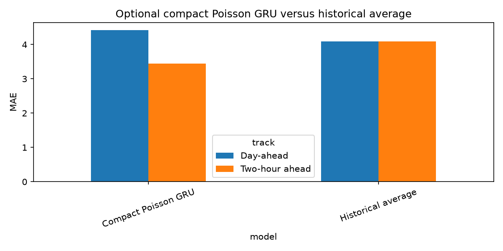

The GRU helps at the two-hour horizon versus Historical Average, but not at day-ahead and not versus LightGBM. Its result is retained as a valid negative/limited-capacity finding rather than tuned post hoc until it wins. On the experiment Mac, PyTorch MPS and CPU GRU batches larger than 16 exited natively during the full workload; the accepted run therefore uses a deterministic CPU batch-size-16 fallback with explicit 10,000/5,000 training/validation caps.

## 9. Forecast examples and feature interpretation

The following representative station-day paths compare actual demand, Historical Average, and LightGBM at the final day-ahead fold.

| Station 128 | Station 402 |
| --- | --- |
| 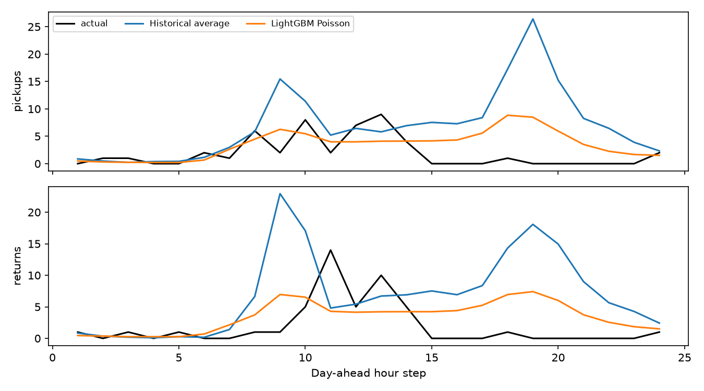 | 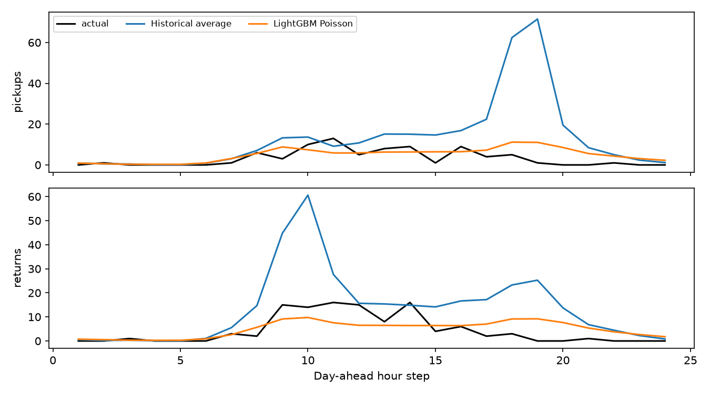 |

### Figure 9. Station 519 forecast path

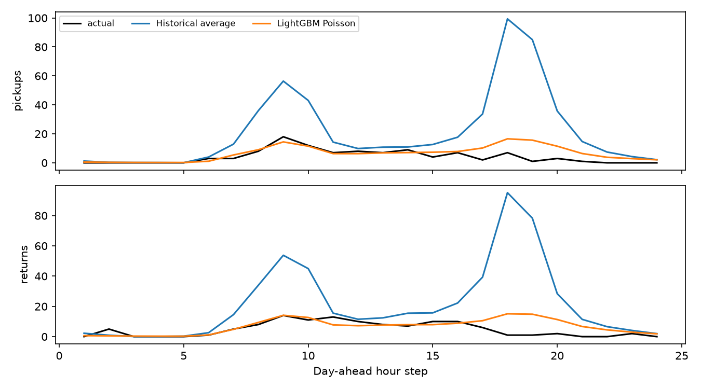

### Figure 10. LightGBM pickup feature importance

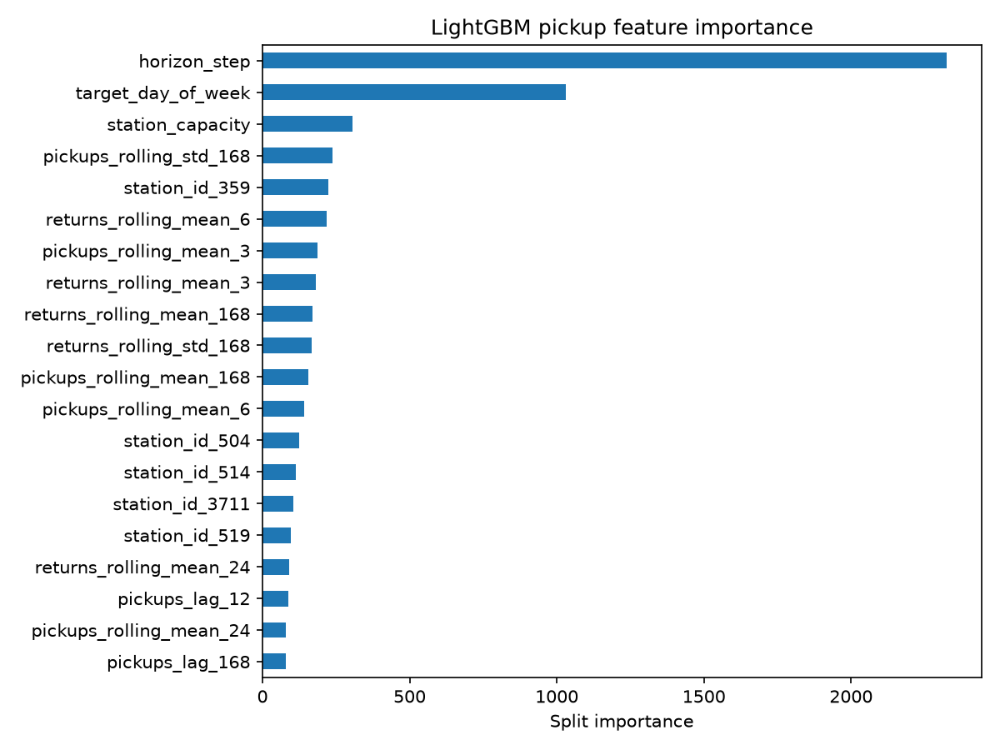

## 10. Limitations and next research steps

1. Observed trips can be censored by stockouts and full docks, so they are realized demand rather than guaranteed latent demand.
2. The source has unzoned DST labels; the explicit incomplete-row policy is transparent but cannot recover missing event-time certainty.
3. Weather results use future observed weather, not archived forecast-vintage weather.
4. The inventory test optimizes station starting inventory only; it does not include rebalancing routes, vehicle capacity, labor, or travel time.
5. The optional GRU is deliberately compact and resource-capped; its result should not be interpreted as a verdict on all deep learning architectures.

The highest-value next extensions are archived GBFS availability for censoring-aware demand analysis, forecast-vintage weather, and a separately scoped truck-routing/rebalancing experiment.

## 11. Data, code, and reproducibility

```bash
uv sync --extra dev --no-editable
make reproduce-smoke
make reproduce-core
```

The optional GRU additionally needs `uv sync --extra dev --extra deep --no-editable` followed by `make gru`.

The versioned publication package includes the core figures and machine-readable tables linked below. Large raw data, model checkpoints, saved predictions, and detailed run manifests are regenerated locally and tracked through source/configuration hashes instead of versioning every binary artifact.

- [Final machine-readable forecast metrics](../reports/tables/forecast_metrics.csv)
- [Station metrics](../reports/tables/station_metrics.csv)
- [Bootstrap comparisons](../reports/tables/bootstrap_comparisons.csv)
- [Decision metrics](../reports/tables/decision_metrics.csv)
- [Runtime metrics](../reports/tables/runtime_metrics.csv)
- [Observed-weather sensitivity](../reports/tables/weather_sensitivity.csv)
- [Full final report](../reports/final_report.md)
